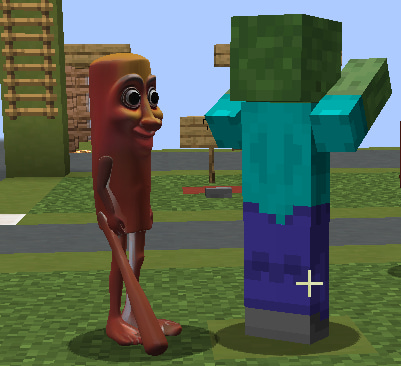

# Glb Player Model Replacer

A small Fabric mod for Minecraft 1.21.4 that replaces player models with custom GLB models.



---

## English

### What it does
Replaces the vanilla player model with a GLB model of your choice. You can toggle replacement for yourself and/or other players, and switch between several built-in models from a small in-game menu.

### Installation
1. Install [Fabric Loader](https://fabricmc.net/use/installer/) for Minecraft **1.21.4**.
2. Drop [Fabric API](https://modrinth.com/mod/fabric-api) into your `mods/` folder.
3. Drop the built mod JAR into the same `mods/` folder.

### Usage
- Launch the game and press **Right Shift** to open the settings screen.
- Tick **Replace your model** / **Replace other players** to choose what gets replaced.
- Use the **Model** dropdown to pick between the bundled models.

### Bundled models
- **Tung Tung Sahur** — Sahur from brainor
- **amogus** — amogus

### Adding your own model
1. Drop a `.glb` file into `src/main/resources/assets/modelreplacer/models/`.
2. Add an entry to `Config.Models`:
   ```java
   MODEL("ModelName", "my_model.glb", forward, left, yawDeg, scale)
   ```
3. Rebuild.

### Limitations
- **No skeletal animations.** The mod renders the mesh statically. Models with rigs/animations will appear in their bind pose.
- Only the first `baseColorTexture` per material is used. Normal/emissive maps are ignored.
- One model file is uploaded to GPU once and reused for every player.

---

## Русский

### Что делает
Заменяет ванильную модель игрока на любую GLB-модель. Можно отдельно включить замену для себя и/или других игроков, а также переключать модели из встроенного меню.

### Установка
1. Поставь [Fabric Loader](https://fabricmc.net/use/installer/) для Minecraft **1.21.4**.
2. Закинь [Fabric API](https://modrinth.com/mod/fabric-api) в папку `mods/`.
3. Туда же закинь собранный JAR этого мода.

### Использование
- Запусти игру и нажми **правый Shift** — откроется окно настроек.
- Галка **Replace your model** — заменять твою модель.
- Галка **Replace other players** — заменять других игроков.
- Дропдаун **Model** — выбор модели из встроенных.

### Встроенные модели
- **Tung Tung Sahur** — сахур
- **Amogus** — амогус

### Как добавить свою модель
1. Закинь `.glb` файл в `src/main/resources/assets/modelreplacer/models/`.
2. Добавь enum-константу в `ReplacerConfig.ModelPreset`:
   ```java
   MODEL("НазваниеМодели", "my_model.glb", forward, left, yawDeg, scale)
   ```
3. Пересобери проект.

### Ограничения
- **Нет скелетных анимаций.** Модель рендерится статично — модели с риг/анимациями покажутся в bind-позе.
- Используется только первая `baseColorTexture` материала. Normal/emissive-карты игнорируются.
- Один файл модели загружается на GPU один раз и переиспользуется для всех игроков.
